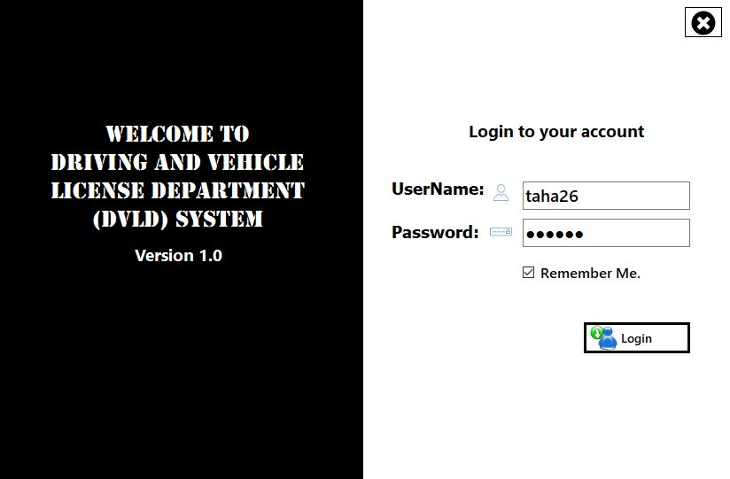
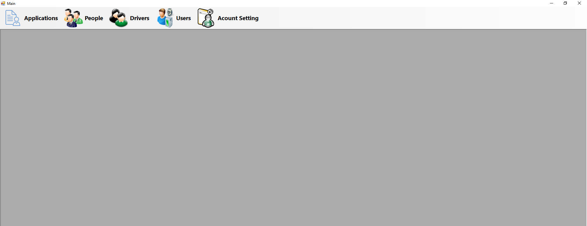
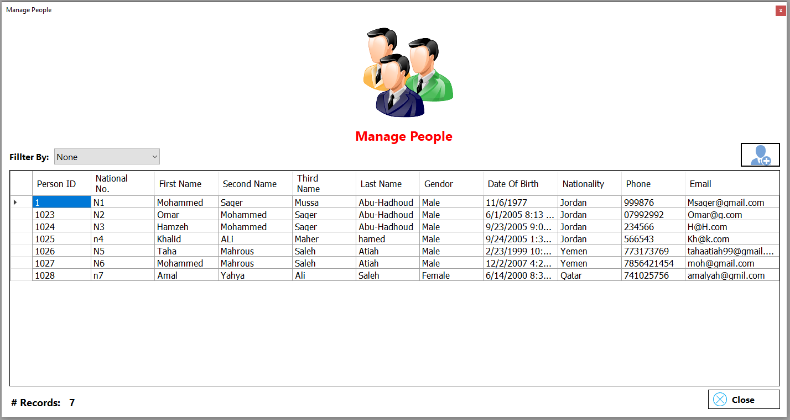
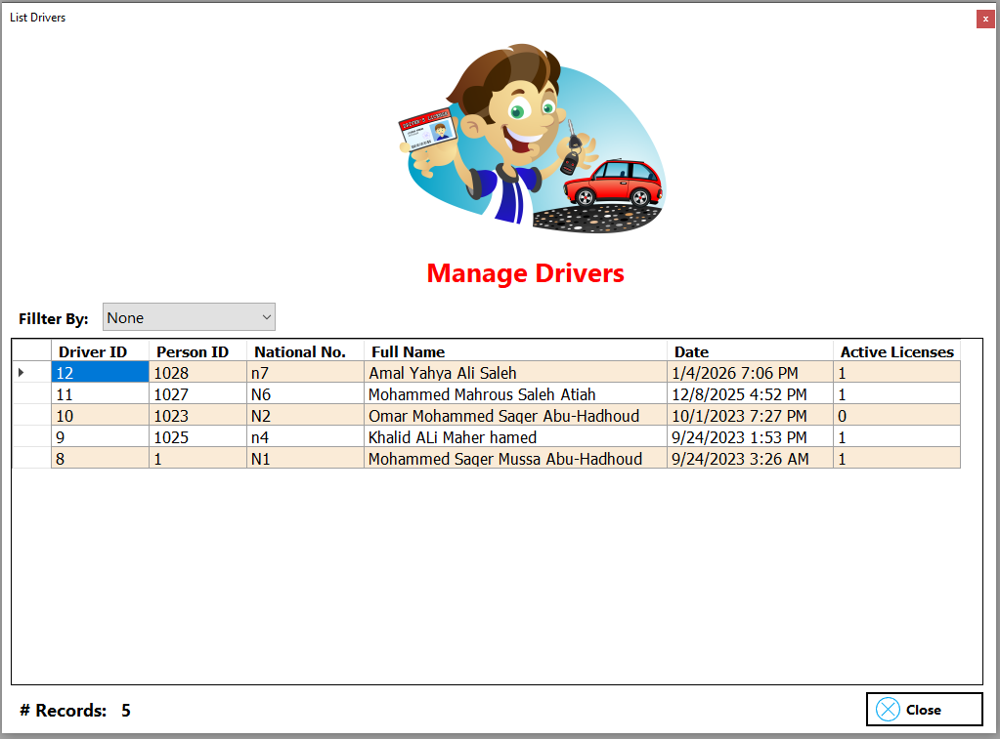
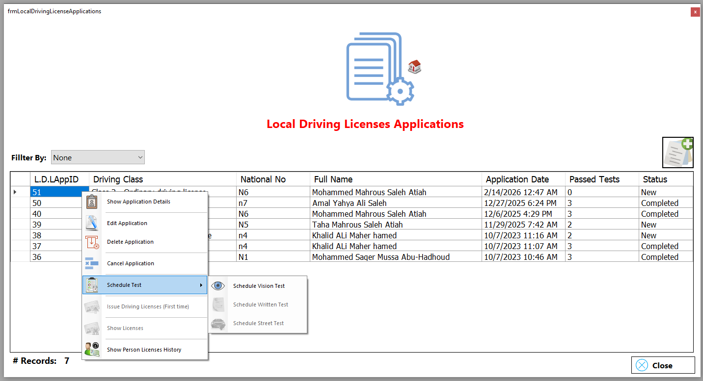
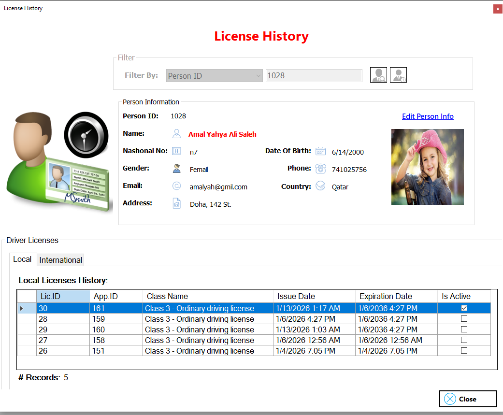
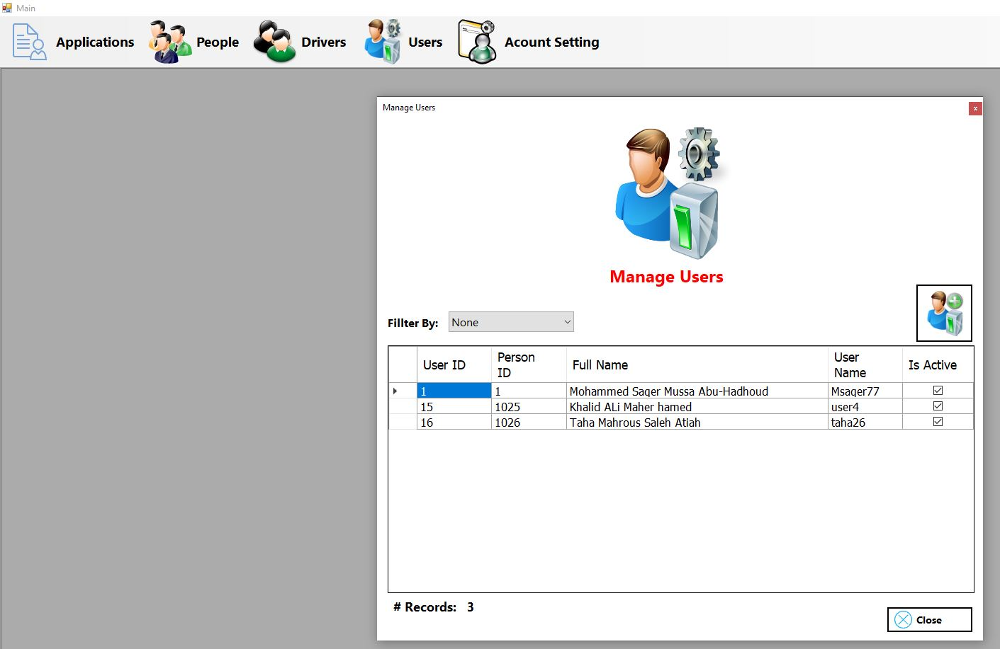

# 🚗 Driving & Vehicles License Department System (DVLD)

> A Real-World Driving License Management System
> Built with C# • .NET Framework 4.7.2 • WinForms • SQL Server
> Designed using Layered Architecture & Business Rule Enforcement

---

## 📌 Project Summary

The **Driving & Vehicles License Department (DVLD)** system is a full desktop application that simulates a real governmental driving license department workflow.

This system is not just CRUD operations — it implements structured business logic, multi-step workflows, permission management, and strict rule validation across the licensing lifecycle.

It demonstrates:

* Clean layered architecture
* Real-world database modeling
* Complex workflow enforcement
* Business rule validation
* Desktop application engineering

---

# 🎯 Key Engineering Highlights

### ✅ Layered Architecture (N-Tier Design)

```
Presentation Layer (WinForms UI)
        ↓
Business Logic Layer (BLL)
        ↓
Data Access Layer (DAL - ADO.NET)
        ↓
SQL Server Database
```

This separation ensures:

* Maintainability
* Scalability
* Testability
* Clear responsibility boundaries

---

### ✅ Business Rule Enforcement

The system enforces real-world logic such as:

* Sequential testing (Vision → Written → Practical)
* Preventing duplicate active applications
* Blocking license issuance if tests are incomplete
* Validating renewals only for expired licenses
* Restricting detained license release logic

This transforms the application from simple data entry to **process-driven workflow management**.

---

### ✅ Modular Project Organization

The project structure reflects domain-driven separation:

* **Applications Module** – Handles license requests and lifecycle
* **Drivers Module** – Manages driver records and history
* **Licenses Module** – Tracks issued, detained, and historical licenses
* **Tests Module** – Scheduling, results, and validation
* **People Module** – Centralized identity records
* **Users Module** – Authentication & permissions
* **Login Module** – Secure system access

This modular breakdown reflects real enterprise system design.

---

# 🧠 System Capabilities

## 👤 Driver & People Management

* Add / Update / Search / View records
* Historical tracking
* Centralized person identity model

## 📝 License Lifecycle Management

* New Local Driving License
* International License Issuance
* License Renewal
* Replacement (Lost/Damaged)
* Release of Detained License
* Status tracking per application

## 🧪 Driving Test Workflow

* Vision Test scheduling
* Written Test scheduling
* Practical Driving Test scheduling
* Controlled progression between stages
* Test result validation logic

## 🔐 Authentication & User Management

* Secure login system
* User management (Add / Update / Permissions)
* Password change functionality

---

# 🛠 Technical Stack

| Category     | Technology                       |
| ------------ | -------------------------------- |
| Language     | C#                               |
| Framework    | .NET Framework 4.7.2             |
| UI           | Windows Forms (WinForms)         |
| Data Access  | ADO.NET                          |
| Database     | SQL Server                       |
| Architecture | Layered (Presentation, BLL, DAL) |

---

## 🔐 Login Screen



## 🏠 Main Dashboard



## 👤 People Management



## 👤 Drivers Management



## 🧪 Test Scheduling



## 📜 License History



## 👥 Users Management



---

# 🚀 Running the Project

## Requirements

* Visual Studio 2019+
* .NET Framework 4.7.2
* SQL Server
* SSMS (recommended)

## Setup Steps

1. Clone the repository:

```bash
git clone https://github.com/tahamahrous-dev/DVLD_Driving_License_Management_System.git
```

2. Restore the provided SQL Server database (`.bak` file)

3. Update the connection string inside `App.config`

4. Set `DVLD_Full_Project` as Startup Project

5. Run with **F5**

---

# 📈 What This Project Demonstrates to Recruiters

✔ Ability to design multi-module enterprise systems
✔ Strong understanding of relational database modeling
✔ Practical use of ADO.NET and SQL Server
✔ Implementation of real-world business rules
✔ Clean separation of concerns
✔ Structured and maintainable codebase
✔ Experience building complete end-to-end desktop systems

This project reflects backend logic strength combined with structured UI implementation.

---

# 🔮 Potential Enhancements

* Migration to .NET 8
* Convert to ASP.NET Core Web Application
* REST API layer
* Dashboard analytics
* Export reports to PDF
* Dependency Injection implementation
* Unit testing integration

---

# 👨‍💻 Author

### **Taha Mahrous**

If you found this project valuable, feel free to ⭐ the repository.

---